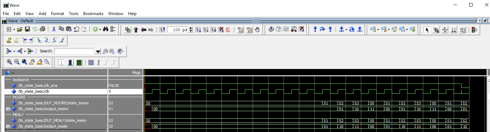

## Example code for basic state machine


This code demonstrated who to implement a mealy and moore state machine in VHDL.

Navigate/change to this directory and run the sim.do file:

```tcl
do sim.do
```

You should see the following wave diagram.



